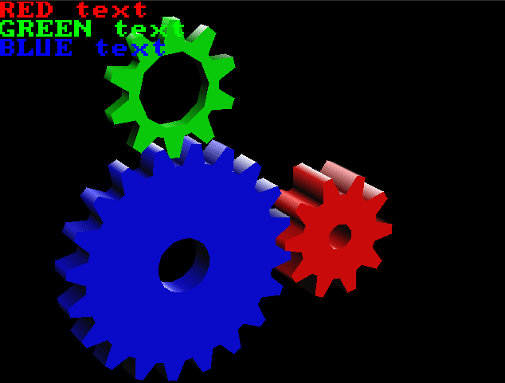

# TinyGL


A major overhaul of Fabrice Bellard's TinyGL to be
more useful as a software rasterizer.

Now with limited multithreading support


## Tightly tweaked and tuned for performance

The library has been tightly tuned using valgrind, perf stat, and other tools.

On a single thread on an i7-6700 (Skylake, 2015),
the standard "gears" demo runs at a higher framerate than glxgears on Mesa using a Ryzen 3900x (2019)
(NOTE: TinyGL Compared without SDL overhead)

I think I can safely say, this is the fastest single-threaded FOSS software GL implementation in existence.

It's probably also the most portable

## Safety features

TinyGL contains the following safety features:

1. compiletime options for glGetError() functionality which obviously slows down speed but increases debugging capability.

2. OpenGL 2.0 buffers, for easy memory management (Anything you put in a buffer using glBufferData will be free'd upon glClose())

3. Fully leak checked using Valgrind- The only leaks you'll see are from your system's SDL. the Raw demos have zero leaks.

## Incredibly portable

TinyGL is written in pure C99, and requires very few functions from the C standard library, it doesn't even require malloc and free
(The calls are aliased to gl_malloc() and gl_free(), which you can replace with your own memory management model if you desire)

## How portable?

* TinyGL still compiles under bellard's Tiny C Compiler.

The SDL examples are now confirmed building with TCC, using TinyCC built from the latest source.

* TinyGL has been compiled for the Nintendo 3DS (proof of concept in another repository)

You can test compiling TinyGL and running it on platforms without SDL by running the RAW DEMOS, which do not require ANYTHING
Except the C standard library and stdio. You may have to change the destination written to by the raw demos on platforms
without standard file systems.

These are the C standard library includes used in the RAW DEMOS.

```c
#include <math.h>
#include <stdio.h>
#include <stdlib.h>
#include <string.h>
#include <stdarg.h>
```
If your system supports it, the library can also take advantage of `alignas` to get improved SIMD support,
which can be disabled in zfeatures. This adds a dependency to `stdalign.h` but greatly increases vertex processing speed.

(This is disabled by default for maximum portability)

If you are unsure if your target platform can support TinyGL, compile it with the buildtime and runtime tests enabled (They are, by default)

if you get a TGL_BUILDT error, then you've failed the buildtime test.

if you try to initialize the library and you get a crash with a print to standard out "TINYGL_FAILED_RUNTIME_COMPAT_TEST" then you've failed the runtime test.

The SDL examples have been tested building on Debian 10 and Windows 10, while tinygl itself has been confirmed to compile on many more platforms.

## Includes a small SIMD-accelerated public domain replacement for GLU
the "Chad Math Library" has been included (CC0, public domain) for your programming needs.

it is simd accelerated on supported platforms, but it contains ZERO platform-specific code- it relies on an optimizing
compiler to get vectorized ops. SIMD acceleration is improved by enabling alignas.

NOTE: There are graphical artifacts visible in these gifs which have been corrected in this version of the library.


Without Polygon Stipple:


With Polygon Stipple:


Hello World test:


Texturing Test: 


Model loading tests:


Without lighting: 


This is a demo of the NO_DRAW_COLOR feature. Notice that the object appears to have a hole in it.


Blending:


Specular:



OpenIMGUI standard demo:


TinyGL 0.8 (c) 1997-2021 Fabrice Bellard, C-Chads, Gek (see License, it's free software)

This is a maintained fork of TinyGL, by the C-Chads.
It is a small, suckless Software-only partial GL 1.1 implementation.

The original project was by Fabrice Bellard. We have forked it.

The changelog is as such:

* Disabled 8, 15, and 24 bit rendering modes. 16 and 32 are the only supported rendering modes (Coincidentally, they are also the fastest)

* Allowed the fixed texture size to be changed at compile time. It must be a power of 2, but that is the only limitation.

* Removed the entire GLX/NanoGLX part of the library. Not portable and mostly useless.

* Implemented new functions and some more of GL 1.1's prototypes including polygon stipple.

* Triangles can now be lit and textured at the same time!

* Removed unused functions which bloat binary size and lengthen compile times.

* Added support for glDepthMask and glDisable(GL_DEPTH_TEST) as per-GL-spec

* ADDED BLENDING SUPPORT!

* Added glDrawPixels

* Added glPixelZoom

* Added glRasterPos2f,3f,4f,2fv,3fv,4fv

* Added glGetString() for GL_VENDOR, GL_RENDERER, GL_VERSION, and optionally GL_LICENSE

* Added comprehensive, usable glGetError() functionality for debugging.

* Fixed a myriad of bugs and... weirdnesses

* Fixed clientside arrays

* Tuned the triangle rasterizer to near-perfection.

* Tuned the transformations to absolute perfection

* Added glDrawArrays

* Added Buffers (For memory management purposes)

* Added glTexImage1D (... it just resizes it to 2D, but it works!)

* Added glPixelSize (TODO is to implement distance scaling)

* Fixed specular rendering

* Added way more compile time options

* Fixed all the memory leaks.

* added Openmp multithreading and glPostProcess()

* Line rendering now obeys glDepthMask and glDepthTest.

* Implemented glRectf

* Implemented compiletime toggles for GL_SELECT and GL_FEEDBACK which significantly
boosts performance. Also, implemented GL_FEEDBACK.

* Accept PR from RobLoach to add Cmake support


Note that this Softrast **is not GL 1.1 compliant** and does not constitute a complete GL implementation.

You *will* have to tweak your code to work with this library. That said, once you have, it will run anywhere that you can get
C99. TinyGL has very few external dependencies.


Notable limitations:

* The only supported texture size and format is decided at compile time. you can set it in zfeatures.h

* A lot of prototypes are missing.

* glPolygonOffset doesn't change anything about how rendering occurs. It does nothing, at the moment. 
The "implementation specific multiplier" is 0.

* There is no stencil buffer.

* Blending can't use alpha values. the rasterizer has no concept of alpha.

* There is no mipmapping, antialiasing, or any form of texture filtering.

* No edge clamping. S and T are wrapped.

* Display lists can be infinitely nested and doing so will crash TinyGL.

* Lit triangles will use the current material properties, even if they are textured. If the diffuse color is black, then your
textured triangles will appear black.

* Textured triangles are affected by their vertex colors- the per-vertex color is used as a "mask" for the texture
on triangles. It is recommended you call glColor3f(1,1,1); before rendering a textured object to get the expected result-
you only need to make this call once, and it can be before glBegin.

* the X dimension of the rendering window with must be a multiple of 4.

* Line rendering is not blended

* The ARB extension for point sprite size attenuation is not enabled.

* Point smoothing is not implemented, points are always squares of a solid color.

* glCopyTexImage2D only works with the size of texture you decided at compile time.

* <Undocumented limitations that have not been tested>

### HOW DO I USE THIS LIBRARY???

TinyGL is not header only, it is a combination of C files, internal headers, and external headers.

The internal headers are only used while compiling the library,

the external headers (gl.h, zfeatures.h, zbuffer.h) are required to use the library.

You CAN compile the library along with your final program into a single compilation unit without separating out the library.

Doing so is the most likely compiling method for embedded platforms and how I got TinyGL running on the 3DS.

The codebase uses very simple compiler flags to compile- in fact it will compile if you just compile all c files together

in the src/ directory.

You can compile the code yourself without makefiles using these directives:

```sh
# inside the src directory
gcc -O3 -c *.c 
ar rcs libTinyGL.a *.o
# the library is now compiled
cp libTinyGL.a ../lib
cd ..
cd SDL_Examples/
# build the menu demo
gcc -O3 menu.c -o menu -lSDL ../lib/libTinyGL.a -lm
# gears
gcc -O3 gears.c -o gears -lSDL ../lib/libTinyGL.a -lm
```

This is how you use TinyGL in a program:

```c
//First you have to include
//(Note that you must either link against libTinyGL.a or compile it in the same compilation unit as your program)
#include "../include/GL/gl.h"
#include "../include/zbuffer.h"

/*
	Somewhere in your program...
*/

//Next, open a framebuffer.
//The "0" parameter is where you pass in a framebuffer pointer if you've already made one.
ZBuffer* frameBuffer = ZB_open(winSizeX, winSizeY, mode, 0);

//Tell TinyGL to initialize on that framebuffer
glInit(frameBuffer);

//Begin making TinyGL calls!

//When you want to copy to your target screen
//Pitch is the width of the target in bytes, or bytes per pixel times width;
ZB_copyFrameBuffer(frameBuffer, screen->pixels, screen->pitch);


//At the end of your application, when you want to clean up.
ZB_close(frameBuffer);
glClose();

```

Note that while you... *can* invoke ZB_Resize to resize the framebuffer, you really shouldn't. It isn't tested.

### WHAT ARE THE MINIMUM REQUIREMENTS OF THIS LIBRARY?

SDL 1.2 is required to run most of the demos I've written, but if you don't have SDL you can still check out the library
by compiling one of the "Raw Demos" which write their output to a file (At the time of writing this, only gears has been added.)

SDL is by no means required to compile or use this library.
SDL is used as a reasonable means of displaying the output of TinyGL for testing.

(I also included some bonus libraries that work well with SDL in the SDL examples if you want to write games using TinyGL!)
(Try compiling the demos with -D PLAY_MUSIC if you have mixer!)
* A c99 compiler
* 32 bit signed and unsigned integer types
* 32 bit binary float type (STDC_IEC_559)
* Some floating point type at least as large as a 32 bit float
* sin and cos functions in math.h
* memcpy in string.h
* assert in assert.h (for debugging only, it can be stubbed)
* a minimal C stdlib
* A memory allocator of some sort with some equivalents or replacements for malloc, calloc, and free.

There is no FILE* usage, or I/O outside of 'msghandling.c' so if you want to remove all stdio dependency, just stub out the calls there.


### Multithreading support

OpenMP is used on supported platforms to multithread certain operations.

(OpenMP is also used in the math library (zmath.h and zmath.c) to explicitly force certain operations
to be SIMD accelerated, so it is recommended that you compile the library with OpenMP support!)


These are the operations that are accelerated by multithreading:

* glDrawPixels

Every scanline is drawn by a separate thread.

* glPostProcess

Every call of the function pointer is run by a separate thread.

* glCopyTexImage2D

Every scan line is copied by a separate thread.

* ZBCopyBuffer

Every scan line is copied by a separate thread.

Compile the library with -fopenmp to see them in action (default). They are used in the texture demo, make sure to add the argument `-pp`

You do not need a multithreaded processor to use TinyGL!

### Performance Recommendations

```
it is recommended that for best performance you keep TinyGL on a separate thread from SDL, and to guard TinyGL's buffer with a mutex.

This is not done in the demos but you can test the... thickness of the SDL stack by invoking gears or helloworld with -nosdl

The framerate doubles.
```
### NEW FUNCTIONS 

These are functions not in the GL 1.1 spec that i've added to make this library more useful.

These functions cannot be added as opcodes to display lists unless specifically listed.

### glDeleteList

An easier to use version of glDeleteLists. glDeleteLists is also implemented.

### glSetEnableSpecular(int shouldenablespecular);

This function can be added to display lists.

Allows you to configure specular rendering. Turn it off
if you want to use GL_LIGHTING but don't plan on using
specular lighting. it will save cycles.

### glGetTexturePixmap(int text, int level, int* xsize, int* ysize)

Allows the user to retrieve the raw pixel data of a texture, for their own modification.

### glDrawText(const unsigned char* text, int x, int y, unsigned int pixel)

This function can be added to display lists as glPlotPixel calls, the text is not saved in a display list.

Is capable of rendering the entire 8 bit latin extended character set (7 bit ascii plus characters 0xa0 and onward...)

You can check how to embed non-standard characters in your strings in the gears demo.

Draws a pre-made 8x8 font to the screen. You can change its displayed size with...

### glTextSize(GLTEXTSIZE mode)

This function can be added to display lists.

Set size of text drawn to the buffer in aforementioned function.

### glPlotPixel(int x, int y, unsigned int pixel)

This function can be added to display lists.

Plot pixel directly to the buffer.

### glGenBuffers, glDeleteBuffers, glBindBuffer (valid target: ARRAY_BUFFER), glBindBufferAsArray

Serverside buffers! Makes it a bit easier to do clientside array stuff at the moment. 
may be the site of future hardware acceleration.

Please look at the model.c demo to see how to use these functions. They function very similarly to their GL 2.0+ counterparts.

### glPostProcess(GLuint (*postprocess)(GLint x, GLint y, GLuint pixel, GLushort z))

Fast, Multithreaded Postprocessing for TinyGL. 

You simply send in a function pointer (The function's name) and glPostProcess does the heavy lifting

The return value is the pixel (ARGB or 5R6G5B depending on mode).

x and y are the screen coordinataes.

pixel is the current color value of the pixel, ARGB or 5R6G5B depending on mode.

z is TinyGL's internal Z buffer representation. Larger values are considered to be "in front" of smaller ones.

This function is multithreaded on supported platforms for maximum execution speed. It of course still works without multithreading, but

it will not be as fast.

Note that you may have to take special care to prevent race conditions when using multithreading with this function.

### NEW glGet calls!!!

You can query glGetIntegerV with these new definitions
```c
	GL_POLYGON_MAX_VERTEX = 0xf001,
	GL_MAX_BUFFERS = 0xf002,
	GL_TEXTURE_HASH_TABLE_SIZE = 0xf003,
	GL_MAX_TEXTURE_LEVELS = 0xf004,
	GL_MAX_SPECULAR_BUFFERS = 0xf005,
	GL_MAX_DISPLAY_LISTS = 0xf006,
	GL_ERROR_CHECK_LEVEL = 0xf007,
	GL_IS_SPECULAR_ENABLED = 0xf008,
```
to query the configuration of TinyGL.

## TOGGLEABLE FEATURES

See `include/zfeatures.h`

This changes too often to maintain documentation here.

The compiletime test is now disabled by default since it may not be "liked" by some obscure compilers...
you can enable it in GL/gl.h

```c
//at the top of include/GL/gl.h
//Enable TinyGL's Compiletime Compatibility Test (Scroll down)
#define COMPILETIME_TINYGL_COMPAT_TEST 1
```

## FIXED BUGS FROM THE ORIGINAL!

TinyGL 0.4 by Bellard had incorrect color interpolation and issues with
GL_FLAT, causing the hello world triangle to look rather...
wrong. Additionally, per vertex color is just cool.

The whole library was filled with memory leaks and read-past-by-one type errors, and they have been corrected.

## Notorious bugs from the original that have been fixed

* GLParam is a union of float, int, uint, and void* which is assumed to be 32 bit... but isn't on 64 bit systems

* Per vertex color is broken due to a faulty optimization in clip.c

* The conventions for 32 bit color were RGBA for textured triangles and ABGR for non-textured. Now both render as ARGB.

* Little endian was assumed in a thousand places in the code

* Non-normalized position was used for lights at infinity.

* Lack of error checking functionality

* Insert unknown bugs here.


  
## FULLY COMPATIBLE WITH RGBA!

The library is now able to be configured properly for RGBA rendering. Note that the output *is actually ARGB* 
but adjusting it is easy, see the SDL examples under SDL_EXAMPLES (They require SDL 1.2 and Mixer to compile)

The library is sometimes by default configured for RGBA or 5R6G5B, check include/zfeatures.h and change the values in this table:
```c
#define TGL_FEATURE_8_BITS         0
#define TGL_FEATURE_24_BITS        0
//These are the only maintained modes.
#define TGL_FEATURE_16_BITS        1
#define TGL_FEATURE_32_BITS        0
```

make sure that only ONE of these values is 1.


## ALSO COMPATIBLE WITH 16 BIT 

Todo: add updated benchmarks


### OpenIMGUI Standard

TinyGL includes an implementation of the OpenIMGUI standard, visible in SDL_EXAMPLES/menu.c

it is a standards proposal I've created for cross-platform immediate mode GUIs as a replacement
for common solutions like "imgui" and Nuklear, which have glaring flaws when discussing their portability.

Consider using it!

_______________________________________________________________________________________

# Here is the old description of TinyGL, saved for historical/attribution purposes:

### I do not endorse or promote its contents, they are here for attribution only.

### General Description:
--------------------

TinyGL is intended to be a very small implementation of a subset of
OpenGL* for embedded systems or games. It is a software only
implementation. Only the main OpenGL calls are implemented. All the
calls I considered not important are simply *not implemented*.

The main strength of TinyGL is that it is fast and simple because it
has not to be exactly compatible with OpenGL. In particular, the
texture mapping and the geometrical transformations are very fast.

The main features of TinyGL are:

- Header compatible with OpenGL (the headers are adapted from the very good
Mesa by Brian Paul et al.)

- Zlib-like licence for easy integration in commercial designs (read
the LICENCE file).

- Subset of GLX for easy testing with X Window. 

- GLX like API (NGLX) to use it with NanoX in MicroWindows/NanoX.

- Subset of BGLView under BeOS.

- OpenGL like lightening.

- Complete OpenGL selection mode handling for object picking.

- 16 bit Z buffer. 16/24/32 bit RGB rendering. High speed dithering to
paletted 8 bits if needed. High speed conversion to 24 bit packed
pixel or 32 bit RGBA if needed.

- Fast Gouraud shadding optimized for 16 bit RGB.

- Fast texture mapping capabilities, with perspective correction and
texture objects.

- 32 bit float only arithmetic.

- Very small: compiled code size of about 40 kB on x86. The file
  src/zfeatures.h can be used to remove some unused features from
  TinyGL.

- C sources for GCC on 32/64 bit architectures. It has been tested
succesfully on x86-Linux and sparc-Solaris.

Examples:
---------

I took three simple examples from the Mesa package to test the main
functions of TinyGL. You can link them to either TinyGL, Mesa or any
other OpenGL/GLX implementation. You can also compile them with
Microwindows.

- texobj illustrates the use of texture objects. Its shows the speed
of TinyGL in this case.

- glutmech comes from the GLUT packages. It is much bigger and slower
because it uses the lightening. I have just included some GLU
functions and suppressed the GLUT related code to make it work. It
shows the display list handling of TinyGL in particular. You can look
at the source code to learn the keys to move the robot. The key 't'
toggles between shaded rendering and wire frame.

- You can download and compile the VReng project to see that TinyGL
has been successfully used in a big project
(http://www-inf.enst.fr/vreng).

Architecture:
-------------

TinyGL is made up four main modules:

- Mathematical routines (zmath).

- OpenGL-like emulation (zgl).

- Z buffer and rasterisation (zbuffer).

- GLX interface (zglx).

To use TinyGL in an embedded system, you should look at the GLX layer
and modify it to suit your need. Adding a more user friendly
developper layer (as in Mesa) may be useful.

Notes - limitations:
--------------------

- See the file 'LIMITATIONS' to see the current functions supported by the API.

- The multithreading could be easily implemented since no global state
is maintainted. The library gets the current context with a function
which can be modified.

- The lightening is not very fast. I supposed that in most games the
lightening is computed by the 3D engine.

- Some changes are needed for 64 bit pointers for the handling of
arrays of float with the GLParam union.

- List sharing is partialy supported in the source, but not by the
current TinyGLX implementation (is it really useful ?).

- No user clipping planes are supported.

- No color index mode (no longer useful !)

- The mipmapping is not implemented.

- The perspecture correction in the mapping code does not use W but
1/Z. In any 'normal scene' it should work.

- The resizing of the viewport in TinyGLX ensures that the width and
the height are multiples of 4. This is not optimal because some pixels
of the window may not be refreshed.

Why ?
-----

TinyGL was developped as a student project for a Virtual Reality
network system called VReng (see the VReng home page at
http://www-inf.enst.fr/vreng).

At that time (January 1997), my initial project was to write my own 3D
rasterizer based on some old sources I wrote. But I realized that it
would be better to use OpenGL to work on any platform. My problem was
that I wanted to use texture mapping which was (and is still) quite
slower on many software OpenGL implementation. I could have modified
Mesa to suit my needs, but I really wanted to use my old sources for
that project. 

I finally decided to use the same syntax as OpenGL but with my own
libraries, thinking that later it could ease the porting of VReng to
OpenGL.

Now VReng is at last compatible with OpenGL, and I managed to patch
TinyGL so that VReng can still work with it without any modifications.

Since TinyGL may be useful for some people, especially in the world of
embedded designs, I decided to release it 'as is', otherwise, it would
have been lost on my hard disk !

------------------------------------------------------------------------------
* OpenGL(R) is a registered trademark of Silicon Graphics, Inc.
------------------------------------------------------------------------------
Fabrice Bellard.
