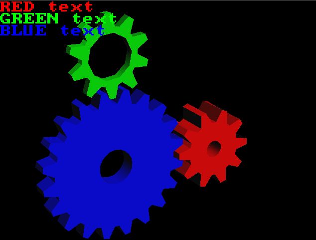

# TinyGL- New and Improved

A rework of Fabrice Bellard's TinyGL (still compiling with -std=c99) to be
more useful as a software rasterizer.

Tightly tweaked for performance,

Valgrind'd for memory leaks in the demos.

It's also lightning fast.

Without Polygon Stipple:



With Polygon Stipple:


Hello World test:


Texturing Test: 


Model loading tests:


Without lighting: 


This is a demo of the NO_DRAW_COLOR feature. Notice that the object appears to have a hole in it.


Blending:


TinyGL 0.8 (c) 1997-2021 Fabrice Bellard, C-Chads, Gek (see License, it's free software)

This is a maintained fork of TinyGL, by the C-Chads.
It is a small, suckless Software-only partial GL 1.1 implementation.

The original project was by Fabrice Bellard. We have forked it.

The changelog is as such:

* Disabled 8, 15, and 24 bit rendering modes. 16 and 32 are the only supported rendering modes (Coincidentally, they are also the fastest)

* Removed the entire GLX/NanoGLX part of the library. Not portable and mostly useless.

* Implemented new functions and some of GL 1.1's prototypes including polygon stipple.

* Triangles can now be lit and textured at the same time!

* Removed unused functions which bloat binary size and lengthen compile times.

* Added support for glDepthMask and glDisable(GL_DEPTH_TEST) as per-GL-spec

* ADDED BLENDING SUPPORT!

* Fixed a myriad of bugs and... weirdnesses


Note that this Softrast **is not GL 1.1 compliant** and does not constitute a complete GL implementation.

You *will* have to tweak your code to work with this library. That said, once you have, it will run anywhere that you can get
C99. TinyGL has very few external dependencies.


Notable limitations:

* The only supported texture size and format is RGB 256x256

* A lot of prototypes are missing.

* glPolygonOffset doesn't change anything about how rendering occurs. It does nothing, at the moment. 
The "implementation specific multiplier" is 0.

* There is no stencil buffer.

* Lit triangles will use the current material properties, even if they are textures. If the diffuse color is black, then your
textured triangles will appear black.

* Lit textured triangles are smoothly shaded, irrespective of glShadeModel (Untextured triangles do not have this bug)

* the X dimension of the rendering window with must be a multiple of 4.

* <Undocumented limitations that have not been tested>

### HOW DO I USE THIS LIBRARY???

```c
//First you have to include
#include "../include/GL/gl.h"
#include "../include/zbuffer.h"

/*
	Somewhere in your program...
*/

//Next, open a framebuffer.
//The "0" parameter is where you pass in a framebuffer pointer if you've already made one.
ZBuffer* frameBuffer = ZB_open(winSizeX, winSizeY, mode, 0);

//Tell TinyGL to initialize on that framebuffer
glInit(frameBuffer);

//Begin making OpenGL calls!
//At the end of your application, when you want to clean up.
ZB_close(frameBuffer);
glClose();

```

Note that while you... *can* invoke ZB_Resize to resize the framebuffer, you really shouldn't. It isn't tested.

### WHAT ARE THE MINIMUM REQUIREMENTS OF THIS LIBRARY?

SDL 1.2 is required to run the demos I've written.

SDL is by no means required to compile or use this library.
SDL is used as a reasonable means of displaying the output of TinyGL for testing.

(I also included some bonus libraries that work well with SDL in the SDL examples if you want to write games using TinyGL!)
(Try compiling the demos with -D PLAY_MUSIC if you have mixer!)
* A c99 compiler
* 32 bit signed and unsigned integer types
* 32 bit binary float type (IEEE 754)
* Some floating point type at least as large as a 32 bit float
* sin and cos functions in math.h
* assert in assert.h
* a minimal C stdlib
* A memory allocator of some sort with some equivalents or replacements for malloc, calloc, and free.

There is no FILE* usage, or I/O outside of 'msghandling.c' so if you want to remove all stdio dependency, just stub out the calls there.


### NEW FUNCTIONS 

These are functions not in the GL 1.1 spec that i've added to make this library more useful.

These functions cannot be added as opcodes to display lists.

### glDeleteList

An easier to use version of glDeleteLists. glDeleteLists is also implemented.

### glSetEnableSpecular(int shouldenablespecular);

Allows you to configure specular rendering. Turn it off
if you want to use GL_LIGHTING but don't plan on using
specular lighting. it will save cycles.

### glGetTexturePixmap(int text, int level, int* xsize, int* ysize)

Allows the user to retrieve the raw pixel data of a texture, for their own modification.

### glDrawText(const unsigned char* text, int x, int y, unsigned int pixel)

This function can be added to display lists.

Draws a pre-made 8x8 font to the screen. You can change its displayed size with...

### glTextSize(GLTEXTSIZE mode)

This function can be added to display lists.

Set size of text drawn to the buffer in aforementioned function.

### glPlotPixel(int x, int y, unsigned int pixel)

This function can be added to display lists.

Plot pixel directly to the buffer.

## TOGGLEABLE FEATURES

See `include/zfeatures.h`

Standard OpenGL features that you can disable for extra performance or smaller binary size.

Note that Polygon Stipple is OFF by default, to improve performance.

Lit texturing is toggleable because it significantly bogs down the rendering of textured triangles even if there is no lighting.
```c
#define TGL_FEATURE_ARRAYS         1
#define TGL_FEATURE_DISPLAYLISTS   1
#define TGL_FEATURE_LIT_TEXTURES   1
//NOTE: Polygon Offset does nothing at the moment.
#define TGL_FEATURE_POLYGON_OFFSET 0
#define TGL_FEATURE_POLYGON_STIPPLE 0
#define TGL_FEATURE_BLEND 			1
```

Change the dimensions of a polygon stipple pattern, and how it's interpreted.

If you're only ever going to use very small stipple patterns, it's recommended you alter these settings.
```c
//A stipple pattern is 128 bytes in size.
#define TGL_POLYGON_STIPPLE_BYTES 128
//A stipple pattern is 2^5 (32) bits wide.
#define TGL_POLYGON_STIPPLE_POW2_WIDTH 5
//The stipple pattern mask (the last bits of the screen coordinates used for indexing)
//The default pattern is 32 bits wide and 32 bits tall, or 4 bytes per row and 32 tall, 4 * 32 = 128 bytes.
#define TGL_POLYGON_STIPPLE_MASK_X 31
#define TGL_POLYGON_STIPPLE_MASK_Y 31
```

These features enable you to achieve the effect of `discard` in GLSL shaders.

You can use this to draw objects which only ever need discard-type alpha transparency.

Simply specify a color to use for that purpose. My favorite choice is hideous magenta (0xff00ff)

The color mask is "and'd" with the color before the test, in case you wanted to only test one color (red, for instance)

Note that when changing between bit depths, you will need to alter the NO_COPY_COLOR and NO_DRAW_COLOR if you use those
features.
```c
#define TGL_FEATURE_NO_COPY_COLOR 0
#define TGL_FEATURE_NO_DRAW_COLOR 0
#define TGL_FEATURE_FORCE_CLEAR_NO_COPY_COLOR 0
#define TGL_NO_COPY_COLOR 0xff00ff
#define TGL_NO_DRAW_COLOR 0xff00ff
//^ solid debug pink.
#define TGL_COLOR_MASK 0x00ffffff
```

Alter the bit depth of rendering. Note that all textures loaded are assumed to be R8G8B8 (in that order, with no Alpha or padding)

Textures are converted internally (see image_util.c) to the renderer's output format.

at the current time, only 16 and 32 bit rendering are maintained and tested regularly.
```c
#define TGL_FEATURE_8_BITS         0
#define TGL_FEATURE_24_BITS        0
//These are the only maintained modes.
#define TGL_FEATURE_16_BITS        0
#define TGL_FEATURE_32_BITS        1
```

## FIXED BUGS FROM THE ORIGINAL!

TinyGL 0.4 by Bellard had incorrect color interpolation and issues with
GL_FLAT, causing the hello world triangle to look rather...
wrong. Additionally, per vertex color is just cool.

## Notorious bugs from the original that have been fixed

* GLParam is a union of float, int, uint, and void* which is assumed to be 32 bit... but isn't on 64 bit systems

* Per vertex color is broken due to a faulty optimization in clip.c

* The conventions for 32 bit color were RGBA for textured triangles and ABGR for non-textured. Now both render as ARGB.

* Little endian was assumed in a thousand places in the code

* Non-normalized position was used for lights at infinity.

* Insert unknown bugs here.


  
## FULLY COMPATIBLE WITH RGBA!

The library is now able to be configured properly for RGBA rendering. Note that the output *is actually ARGB* 
but adjusting it is easy, see the SDL examples under SDL_EXAMPLES (They require SDL 1.2 and Mixer to compile)

The library is sometimes by default configured for RGBA or 5R6G5B, check include/zfeatures.h and change the values in this table:
```c
#define TGL_FEATURE_8_BITS         0
#define TGL_FEATURE_24_BITS        0
//These are the only maintained modes.
#define TGL_FEATURE_16_BITS        1
#define TGL_FEATURE_32_BITS        0
```

make sure that only ONE of these values is 1.


## ALSO COMPATIBLE WITH 16 BIT 

~~~~~~~~~~~~~~~~~~~~~~~~~~~~~~~~~~~~~~~~~~~~~~~~~~~~~~~~~~~~~~~~~~~~~~~~~~~~~~~~~~~~~~~~~~~~~~~~~~~~~~~
## BENCHMARK RESULTS
~~~~~~~~~~~~~~~~~~~~~~~~~~~~~~~~~~~~~~~~~~~~~~~~~~~~~~~~~~~~~~~~~~~~~~~~~~~~~~~~~~~~~~~~~~~~~~~~~~~~~~~
### CPU: i7-6700 (Gek)
### OS: Linux Mint Debian Edition

at the default settings, 32 bit,
```c
#define TGL_FEATURE_ARRAYS         1
#define TGL_FEATURE_DISPLAYLISTS   1
#define TGL_FEATURE_LIT_TEXTURES   1
//NOTE: Polygon Offset does nothing at the moment.
#define TGL_FEATURE_POLYGON_OFFSET 0
#define TGL_FEATURE_POLYGON_STIPPLE 0
//A stipple pattern is 128 bytes in size.
#define TGL_POLYGON_STIPPLE_BYTES 128
//A stipple pattern is 2^5 (32) bits wide.
#define TGL_POLYGON_STIPPLE_POW2_WIDTH 5
//The stipple pattern mask (the last bits of the screen coordinates used for indexing)
//The default pattern is 32 bits wide and 32 bits tall, or 4 bytes per row and 32 tall, 4 * 32 = 128 bytes.
#define TGL_POLYGON_STIPPLE_MASK_X 31
#define TGL_POLYGON_STIPPLE_MASK_Y 31

//These are features useful for integrating TinyGL with other renderers.
#define TGL_FEATURE_NO_COPY_COLOR 0
#define TGL_FEATURE_NO_DRAW_COLOR 0
#define TGL_FEATURE_FORCE_CLEAR_NO_COPY_COLOR 0
#define TGL_NO_COPY_COLOR 0xff00ff
#define TGL_NO_DRAW_COLOR 0xff00ff
//^ solid debug pink.
#define TGL_COLOR_MASK 0x00ffffff

//..

#define TGL_FEATURE_16_BITS        0
#define TGL_FEATURE_32_BITS        1
```

```
./model -m monkey3.obj -count 27
```

Hovers around 55-62 fps at count 27. 
(I get the exact same performance figures with textures disabled)

```
./gears
Low: 731 FPS
High: 885 FPS
Average: around 835
```

```
./helloworld
Low: 1178 FPS
High: 1530 FPS
Average: around 1380 FPS
```

```
./texture
Low: 476 FPS
High: 547 FPS
Average: around 510 FPS
```
#### With NO_DRAW_COLOR enabled, otherwise the same

```
./model -m monkey3.obj -count 24
```

Raising the count above 25 causes the count to unreliably stay above 50 FPS and never reach 60.

```
./texture
Low: 467 FPS
High: 592 FPS
Average: around 570 FPS
```
Surprising that it actually runs faster

```
./gears
Low: 804 FPS
High: 917 FPS
Average: around 842 FPS
```
~~~~~~~~~~~~~~~~~~~~~~~~~~~~~~~~~~~~~~~~~~~~~~~~~~~~~~~~~~~~~~~~~~~~~~~~~~~~~~~~~~~~~
# Here is the old description of TinyGL, saved for historical/attribution purposes:

### General Description:
--------------------

TinyGL is intended to be a very small implementation of a subset of
OpenGL* for embedded systems or games. It is a software only
implementation. Only the main OpenGL calls are implemented. All the
calls I considered not important are simply *not implemented*.

The main strength of TinyGL is that it is fast and simple because it
has not to be exactly compatible with OpenGL. In particular, the
texture mapping and the geometrical transformations are very fast.

The main features of TinyGL are:

- Header compatible with OpenGL (the headers are adapted from the very good
Mesa by Brian Paul et al.)

- Zlib-like licence for easy integration in commercial designs (read
the LICENCE file).

- Subset of GLX for easy testing with X Window. 

- GLX like API (NGLX) to use it with NanoX in MicroWindows/NanoX.

- Subset of BGLView under BeOS.

- OpenGL like lightening.

- Complete OpenGL selection mode handling for object picking.

- 16 bit Z buffer. 16/24/32 bit RGB rendering. High speed dithering to
paletted 8 bits if needed. High speed conversion to 24 bit packed
pixel or 32 bit RGBA if needed.

- Fast Gouraud shadding optimized for 16 bit RGB.

- Fast texture mapping capabilities, with perspective correction and
texture objects.

- 32 bit float only arithmetic.

- Very small: compiled code size of about 40 kB on x86. The file
  src/zfeatures.h can be used to remove some unused features from
  TinyGL.

- C sources for GCC on 32/64 bit architectures. It has been tested
succesfully on x86-Linux and sparc-Solaris.

Examples:
---------

I took three simple examples from the Mesa package to test the main
functions of TinyGL. You can link them to either TinyGL, Mesa or any
other OpenGL/GLX implementation. You can also compile them with
Microwindows.

- texobj illustrates the use of texture objects. Its shows the speed
of TinyGL in this case.

- glutmech comes from the GLUT packages. It is much bigger and slower
because it uses the lightening. I have just included some GLU
functions and suppressed the GLUT related code to make it work. It
shows the display list handling of TinyGL in particular. You can look
at the source code to learn the keys to move the robot. The key 't'
toggles between shaded rendering and wire frame.

- You can download and compile the VReng project to see that TinyGL
has been successfully used in a big project
(http://www-inf.enst.fr/vreng).

Architecture:
-------------

TinyGL is made up four main modules:

- Mathematical routines (zmath).

- OpenGL-like emulation (zgl).

- Z buffer and rasterisation (zbuffer).

- GLX interface (zglx).

To use TinyGL in an embedded system, you should look at the GLX layer
and modify it to suit your need. Adding a more user friendly
developper layer (as in Mesa) may be useful.

Notes - limitations:
--------------------

- See the file 'LIMITATIONS' to see the current functions supported by the API.

- The multithreading could be easily implemented since no global state
is maintainted. The library gets the current context with a function
which can be modified.

- The lightening is not very fast. I supposed that in most games the
lightening is computed by the 3D engine.

- Some changes are needed for 64 bit pointers for the handling of
arrays of float with the GLParam union.

- List sharing is partialy supported in the source, but not by the
current TinyGLX implementation (is it really useful ?).

- No user clipping planes are supported.

- No color index mode (no longer useful !)

- The mipmapping is not implemented.

- The perspecture correction in the mapping code does not use W but
1/Z. In any 'normal scene' it should work.

- The resizing of the viewport in TinyGLX ensures that the width and
the height are multiples of 4. This is not optimal because some pixels
of the window may not be refreshed.

Why ?
-----

TinyGL was developped as a student project for a Virtual Reality
network system called VReng (see the VReng home page at
http://www-inf.enst.fr/vreng).

At that time (January 1997), my initial project was to write my own 3D
rasterizer based on some old sources I wrote. But I realized that it
would be better to use OpenGL to work on any platform. My problem was
that I wanted to use texture mapping which was (and is still) quite
slower on many software OpenGL implementation. I could have modified
Mesa to suit my needs, but I really wanted to use my old sources for
that project. 

I finally decided to use the same syntax as OpenGL but with my own
libraries, thinking that later it could ease the porting of VReng to
OpenGL.

Now VReng is at last compatible with OpenGL, and I managed to patch
TinyGL so that VReng can still work with it without any modifications.

Since TinyGL may be useful for some people, especially in the world of
embedded designs, I decided to release it 'as is', otherwise, it would
have been lost on my hard disk !

------------------------------------------------------------------------------
* OpenGL(R) is a registered trademark of Silicon Graphics, Inc.
------------------------------------------------------------------------------
Fabrice Bellard.
